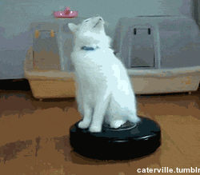

# Roomba  -  Email spam remover
Wipes out 99.9% of **SPAM**.
Made with **Python**
## **References**

 - [Using gmail api in python](https://www.thepythoncode.com/article/use-gmail-api-in-python)
 - [Gmail api docs](https://developers.google.com/gmail/api/guides)
 

## **Required libraries**

 - google-api-python-client
 - google-auth-httplib2
 - google-auth-oauthlib

## **Contributors**

 - [Anrid239]( https://github.com/Anrid239)
 - [Ananthan831](https://github.com/Ananthan831)
 - [LenOfAl](https://github.com/LenOfAl)

---

 
